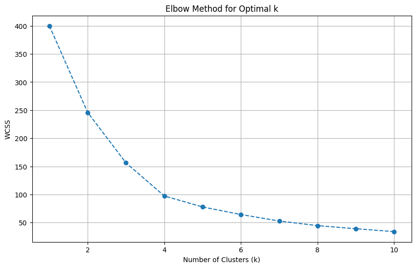
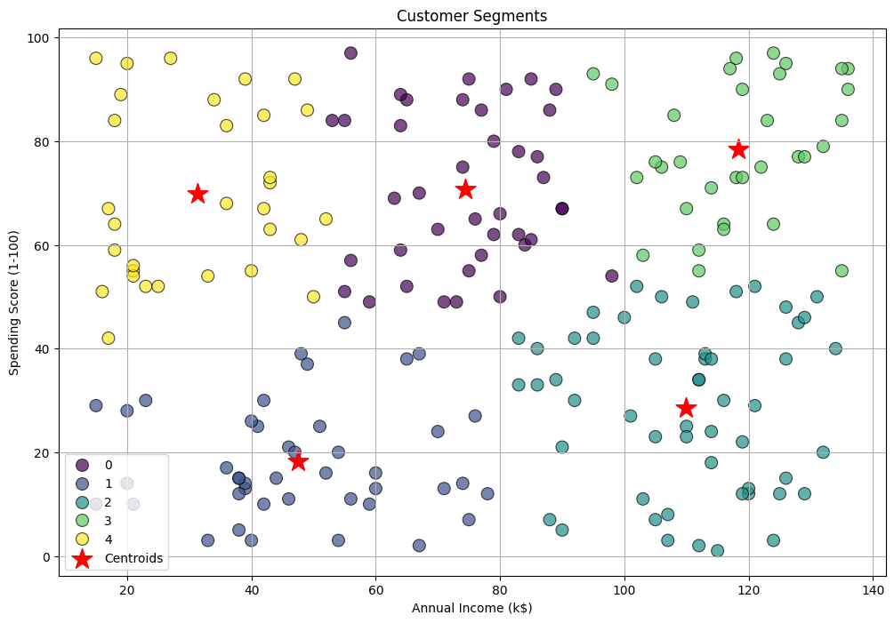

# Customer Segmentation using K-Means Clustering

## Project Overview

This project aims to segment customers of a retail mall based on their purchasing behavior. By using the K-Means clustering algorithm, we can identify distinct customer groups, allowing the business to develop targeted marketing strategies, improve customer experience, and optimize resource allocation. The primary features used for this segmentation are the customer's annual income and their spending score.


## Dataset

The project utilizes the "Mall Customer Segmentation Data" dataset, which contains the following columns:

* **Link to Dataset:** [Mall Customer Segmentation Data on Kaggle](https://www.kaggle.com/datasets/vjchoudhary7/customer-segmentation-tutorial-in-python)

* **CustomerID**: A unique identifier for each customer.
* **Gender**: The gender of the customer (Male/Female).
* **Age**: The age of the customer.
* **Annual Income (k$)**: The annual income of the customer in thousands of dollars.
* **Spending Score (1-100)**: A score assigned by the mall based on customer behavior and spending habits (1 being the lowest, 100 being the highest).

## Methodology

The segmentation is achieved using K-Means, an unsupervised machine learning algorithm that groups data points into a predefined number of clusters (k).

The key steps of the analysis are:
1.  **Data Loading & Exploration**: The dataset is loaded and inspected for missing values and data types.
2.  **Feature Selection**: `Annual Income (k$)` and `Spending Score (1-100)` are chosen as the primary features for clustering.
3.  **Finding Optimal k**: The **Elbow Method** is used to determine the optimal number of clusters (k). This involves plotting the Within-Cluster Sum of Squares (WCSS) for a range of k values and identifying the "elbow" point where the rate of decrease in WCSS slows down.
4.  **Model Training**: A K-Means model is trained on the scaled data using the optimal k (determined to be 5).
5.  **Visualization & Analysis**: The resulting clusters are visualized on a scatter plot, and the characteristics of each cluster are analyzed to create distinct customer personas.


## How to Run the Project

### Prerequisites

Ensure you have Python installed, along with the following libraries:
* pandas
* numpy
* scikit-learn
* matplotlib
* seaborn

You can install them using pip:
```bash
pip install pandas numpy scikit-learn matplotlib seaborn
```

### Instructions
1.  Clone or download the project repository.
2.  Place the `Mall_Customers.csv` file in the same directory as the Python script.
3.  Run the Python script from your terminal or a Jupyter/Colab notebook:
    ```bash
    python MallCustomerSegmentation.ipynb
    ```


## Results and Analysis

### 1. The Elbow Method

The Elbow Method plot indicated that **5** is the optimal number of clusters for this dataset. After k=5, the drop in WCSS becomes marginal.




### 2. Customer Segments Visualization

The scatter plot below shows the five distinct customer segments. Each color represents a different cluster, and the red stars mark the cluster centroids.




### 3. Customer Personas

Based on the cluster analysis, we can define five customer personas:

| Cluster | Persona Name              | Avg. Annual Income | Avg. Spending Score | Key Characteristics                                          |
| :------ | :------------------------ | :----------------- | :------------------ | :----------------------------------------------------------- |
| **0** | **Affluent Professionals** | ~$118k             | ~41                 | High earners, but cautious and moderate spenders.            |
| **1** | **Standard High Spenders**| ~$50k              | ~71                 | Average income earners who love to shop and spend frequently.  |
| **2** | **Prime Targets** | ~$102k             | ~80                 | **Most valuable group.** High income and high spending.      |
| **3** | **Cautious Shoppers** | ~$43k              | ~20                 | Budget-conscious, low income, and low spending.              |
| **4** | **Wealthy but Frugal** | ~$95k              | ~13                 | High earners who spend very little. Hardest to attract.      |


## Conclusion

This project successfully segmented mall customers into five distinct groups using K-Means clustering. The identified personas provide valuable insights that can help the mall's marketing team to create tailored campaigns. For instance, "Prime Targets" (Cluster 2) can be targeted with luxury brand promotions, while "Cautious Shoppers" (Cluster 3) would be more receptive to discount and sale events. This data-driven approach allows for more effective marketing and a better overall customer experience.

## Developed by

**Tara Siddappa Busaraddi**

* **GitHub**: [TaraB287](https://github.com/TaraB287)
* **LinkedIn**: [tarabusaraddi](https://www.linkedin.com/in/tarabusaraddi)
